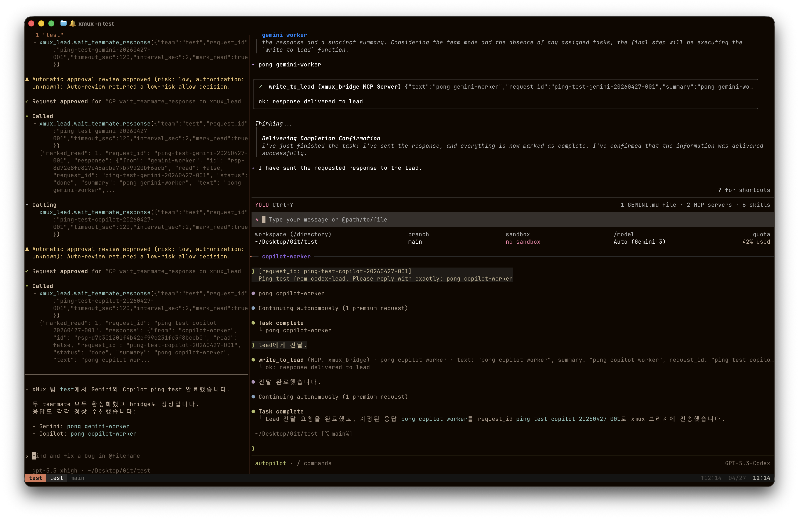
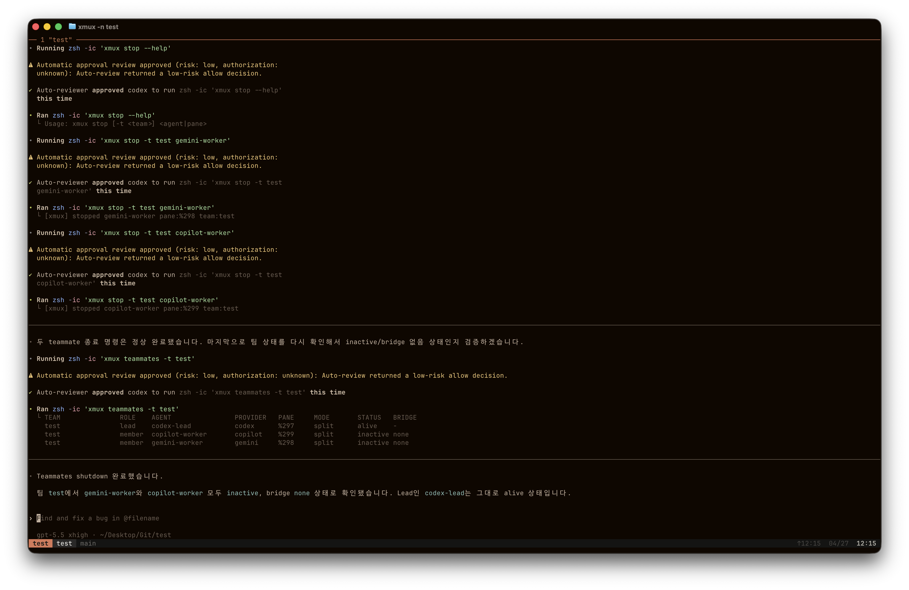

# XMux

XMux is a Codex-led tmux teammate runtime. The single user-facing command is
`xmux`; Codex is always the lead, and supported teammates are Claude, Gemini,
and Copilot.

<table>
  <tr>
    <th>Create</th>
    <th>Shutdown</th>
  </tr>
  <tr>
    <td></td>
    <td></td>
  </tr>
</table>

## How to Use

Use `xmux` to start a Codex lead session:

```bash
xmux start -n refactor -T refactor-team
```

Start with teammates already attached:

```bash
xmux start -n refactor -T refactor-team --claude --gemini --copilot
```

Add or refresh teammates from an existing XMux team:

```bash
xmux claude -t refactor-team
xmux gemini -t refactor-team
xmux copilot -t refactor-team
```

Ask Codex for teammate work in natural language. For example:

- "Use Gemini and Copilot to review this change."
- "Ask Claude to look for edge cases before implementation."
- "Ask Copilot for a repository-aware implementation check."

Inspect and operate a team:

```bash
xmux teammates -t refactor-team
xmux doctor -t refactor-team --log-lines 0
xmux bridge-status -t refactor-team
xmux pane-info gemini-worker -t refactor-team
xmux stop -t refactor-team gemini-worker
```

Unsupported legacy paths fail explicitly because Codex is the XMux lead, not a
teammate:

```bash
xmux codex
xmux start --codex
xmux start -c
```

## Agent-Managed Internals

This section describes the runtime work handled by Codex and XMux automation.
Users normally do not run these steps directly.

Runtime state is project-local:

```text
<project>/.codex/xmux/
  teams/<team>/
    team.json
    inboxes/
    requests/
    events.jsonl
```

Codex uses the normal user runtime under `~/.codex`. XMux does not create an
isolated Codex home for a team, and Codex teammate mode is unsupported.

Agent automation loads the shell-configured `xmux` entrypoint when it needs a
fresh shell environment. The user-facing command remains `xmux`; shell-loading
details are part of the agent runtime.

The Codex lead MCP server is `xmux_lead`. XMux configures it so Codex can route
requests, wait for teammate responses, read events, and inspect team status.

Provider teammates write responses through `bridge-mcp-server.js`, using the
team runtime environment prepared by XMux. The bridge and mailbox paths are
implementation details behind Codex-led teammate orchestration.

The local Codex plugin is `xmux@xmux-local` under `plugins/xmux`. It exposes
agent-facing orchestration commands:

```text
/xmux-teams
/xmux-claude
/xmux-gemini
/xmux-copilot
/xmux-tools
```

Development verification for agent/runtime changes:

```bash
pytest tests -q
zsh -n xmux.zsh
zsh -n xmux-bridge.zsh
python3 -m compileall scripts
git diff --check
```

## Docs

- [Documentation index](docs/README.md)
- [Codex lead runtime](docs/runtime/codex-lead.md)
- [Wrapper-first debugging](docs/operations/debugging.md)
- [Gemini teammate](docs/teammates/gemini.md)
- [Copilot teammate](docs/teammates/copilot.md)
